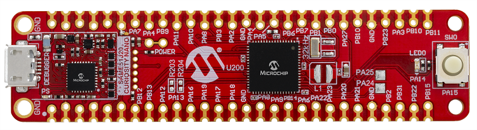

# MPLAB X Project: x2cscope_blinky_same51_cnano

This is a X2CScope demo project for [SAME51 Curiosity Nano](https://www.microchip.com/DevelopmentTools/ProductDetails/PartNO/EV76S68A) development board and [ATSAME51J20A](https://www.microchip.com/wwwproducts/en/ATSAME51J20A) microcontroller. 

The purpose is to demonstrate the X2CScope tool features like run-time watch and run-time scope views.

The firmware generates a sawtooth signal and a sine signal. There is LED2 (PA14 - LED0 on the baord) that is blinking with the sawtooth signals period. The second psuedo LED1 (PB15) can be controlled manually by the X2Cscope Watch tool. The state of the SW1 (PA15) can be read out by X2Cscope.

## Getting Started

The demo is ready to use with the [listed hardwares below](#hardware).

1. Clone or Download project to X2CScope_blinky_SAME51_CNANO folder. (Keep the folder name)
2. [Connect Hardware](#connectors-used)
3. Open project - firmware\X2CScope_blinky_SAME51_CNANO.X with MPLAB X
4. Build project then program the HW

## Use X2Cscope

The X2Cscope tool uses the UART to transfer data from and to the HW. To use this feature follow the steps:

1. Verify if X2Cscope plug-in is installed within MPLAB X. Detailed user guide: https://x2cscope.github.io/
2. Open X2Cscope 

3. Verify UART settings at the Connection Setup tab and also check the COM port number on the PC. (device manager)

4. Connect to the HW with clicking on the connect sign:

6. Use the data views (available on the Data Views tab).

### Hardware

* **SAME51 Curiosity Nano:** [EV76S68A](https://www.microchip.com/DevelopmentTools/ProductDetails/PartNO/EV76S68A)

### Connectors used:
* **Debug USB:** Connection for the onboard debugger & VCP (Virual COM Port)
* **PB15:** Psuedo LED1 output
* **PA14:** LED2 output (LED0 in schematics/Silkscreen)
* **PA15:** Switch Input SW1

### Configuration

The SAME51 Curiosity Nano is used in its default configuration, no hardware/Jumper changes are necesary

## Peripheral settings and I/O connections: 

**SERCOM5 (UART):**
   * Baud rate: 115200
   * Parity: None
   * Data bits: 8
   * Stop bits: 1
   * Flow control: no
   
**TIMER1 (TC1):**
   * 1ms period
   * interrupt enabled

**IO**

| PIN | PORT   | SW Function |
| ----|--------|-------------|
|  39 | PB16   | SERCOM5 TX  |
|  40 | PB17   | SERCOM5 RX  |
|  28 | PB15   | IO_LED1     |
|  31 | PA14   | IO_LED2     |
|  32 | PA15   | IO_SW1      |

## Peripheral settings and I/O connections: 

   Peripherals are configured using [Harmony 3](https://www.microchip.com/en-us/development-tools-tools-and-software/embedded-software-center/mplab-harmony-v3) according to the SAME51 Curiosity Nano [schematics](https://ww1.microchip.com/downloads/en/DeviceDoc/SAME51-Curiosity-Nano-User-Guide-DS70005432A.pdf).

   If you need more details for peripheral configuration, open [The Harmony 3 help](https://github.com/Microchip-MPLAB-Harmony/Microchip-MPLAB-Harmony.github.io/wiki)

## Software & Build Environment

The demo requires the following to Applications and Plugins:
* [MPLABX 5.4x and upwards](https://www.microchip.com/mplab/mplab-x-ide) Integrated Development Environment. 
* [X2CScope Plugin](https://microchip-mplab-harmony.github.io/x2c/x2c-scope/docs/readme.html) X2Cscope Plugin for MPLABX - requires intsall from plugin menu in MPLABX IDE
* [XC32 v2.20](https://www.microchip.com/mplab/compilers) - Microchip C compiler for 32bit micros
* [Harmony 3.xx](https://www.microchip.com/en-us/development-tools-tools-and-software/embedded-software-center/mplab-harmony-v3) - Code Generation and Configuruation tool

If SW modification is required then the Harmony 3 plugin will need to be installed alongside packages through the Harmony 3 content manager.
