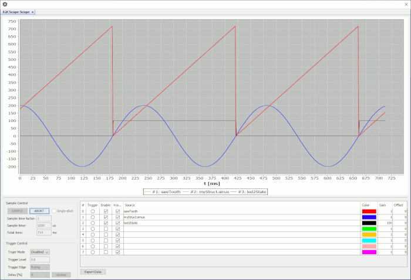

# MPLAB X Project: x2cscope_blinky_same51_cnano

This is a X2CScope demo project for [SAME51 Curiosity Nano](https://www.microchip.com/DevelopmentTools/ProductDetails/PartNO/EV76S68A) development board and [ATSAME51J20A](https://www.microchip.com/wwwproducts/en/ATSAME51J20A) microcontroller. 

The purpose is to demonstrate the X2CScope tool features like run-time watch and run-time scope views.

The code functionality is generating a sawtooth signal and a sine signal. There is one LED (PA14) that is blinking with the sawtooth signals period. The second psuedo LED (PB15) can be controlled manually by the X2Cscope Watch tool. The state of the SW1 (PA15) can be read out by X2Cscope.

## Getting Started

The demo is ready to use with the [listed hardwares below](#hardware).

1. Clone or Download project to X2CScope_blinky_SAME51_CNANO folder. (Keep the folder name)
2. [Connect Hardware](#connectors-used)
3. Open project - firmware\X2CScope_blinky_SAME51_CNANO.X with MPLAB X
4. Build project then program the HW

## Monitoring signals

The demo is shiped with run time monitoring and tuning feature using the X2CScope plugin and Harmony 3 X2C package using the X2CScope Component.

The X2CScope component uses the Virtual COM Port (VCP) to transfer data from and to the HW. To use this feature follow the steps:

### Hardware

* **SAME51 Curiosity Nano:** [EV76S68A](https://www.microchip.com/DevelopmentTools/ProductDetails/PartNO/EV76S68A)

### Connectors used:
* **Debug USB:** Connection for the onboard debugger & VCP (Virual COM Port)
* **PB15:** Psuedo LED1 output
* **PA14:** LED2 output (LED0 in schematics/Silkscreen)
* **PA15:** Switch Input SW1

### Configuration

The SAME51 Curiosity Nano is used in its default configuration, no changes are necesary

## Peripheral settings and I/O connections: 

   Peripherals are configured by [Harmony 3](https://www.microchip.com/en-us/development-tools-tools-and-software/embedded-software-center/mplab-harmony-v3) according to the SAME51 Curiosity Nano [schematics](https://ww1.microchip.com/downloads/en/DeviceDoc/SAME51-Curiosity-Nano-User-Guide-DS70005432A.pdf).

   If you need more details for peripheral configuration, open [The Harmony 3 help](https://github.com/Microchip-MPLAB-Harmony/Microchip-MPLAB-Harmony.github.io/wiki)

### Software & Build Environment

The demo requires the following to start:
* [MPLAB X 5.4x and upwards](https://www.microchip.com/mplab/mplab-x-ide) Integrated Development Environment. 
* [XC32 v2.20](https://www.microchip.com/mplab/compilers) - Microchip C compiler for 32bit micros
* [Harmony 3.xx](https://www.microchip.com/en-us/development-tools-tools-and-software/embedded-software-center/mplab-harmony-v3) - Code Generation and Configuruation tool
* X2CScope MPLABX Plugin (requires intsall from plugin menu in MPLABX IDE). 
If SW modification is required then the Harmony 3 plugin will need to be installed alongside packages through the Harmony 3 content manager: